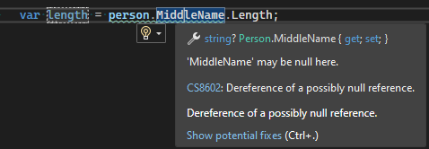

# What's new in C# 8
## Pattern matching
Following code can be simplified by using  `{}`:
```csharp
if (!(person?.MiddleName is null person))
{
    // Code ...
}
``` 
Can be simplified to:
```csharp
if (person?.MiddleName is { } person)
{
    // Code ...
}
```
The `null` check for `FirstName` property can be embedded  in pattern matching:
```csharp
if (person is {FirstName.Length: var length})
{
    return length;
}
return 0;
```
## Suppress *Dereference of a possibly null reference warning*
If a compiler detects possible null reference most of the time the warning is valid. 

The warning can be suppressed in a code by adding `!`.

```csharp
var length = person.MiddleName!.Length;
```

## Attribute for nullability

An custom method which is checking whether a string is null or empty  returns a `bool` value.

```csharp
private static int GetLastNameLength(Person person)	
{
	if (IsNullOrEmpty(person.MiddleName))
    	return 0;
    return person.MiddleName.Length;
}

private static bool IsNullOrEmpty(string? personMiddleName)
{
    if (personMiddleName == string.Empty)
		return true;
	if (personMiddleName is null)
		return true;
	return false;
}
```

The code below causes warning about possible null reference.


In order to fix the warning `NotNullWhenFalse` attribute must be used.

``` csharp
private static bool IsNullOrEmpty([NotNullWhen(false)]string? personMiddleName)
```

.NET `string.IsNullOrEmpty` implementation is written in the same way:

```csharp
public static bool IsNullOrEmpty([NotNullWhen(false)] string? value)
```