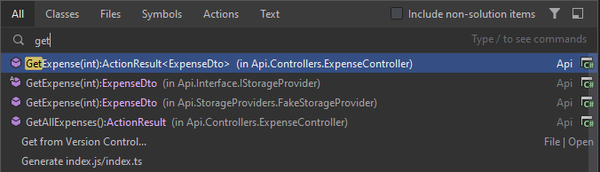
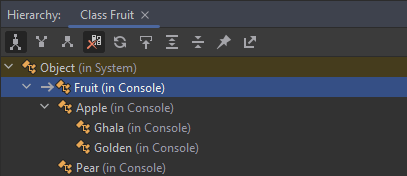
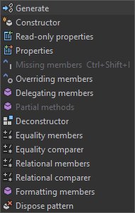
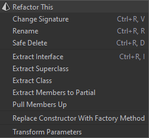
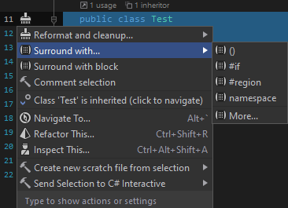

# Resharper - best features

## [Search Everywhere / Go to Type](https://www.jetbrains.com/help/resharper/Navigation_and_Search__Go_to_Type.html)

**ReSharper | Navigate | Search Everywhere / Go to Type…**  
`Ctrl + T` `(ReSharper_GotoBase)`

This command combines two different features:

- **Search Everywhere**, which appears first, allows you to navigate to the following destinations: types, symbols, files, string literals in source and textual files, recent edits, recent files, and recently viewed methods
- **Go to Type**, which appears the second time you press Ctrl+T or invoke the command from the menu, allows you to navigate to any type.

## [Explore type hierarchy](https://www.jetbrains.com/help/resharper/Navigation_and_Search__Viewing_Type_Hierarchy.html)

**ReSharper | Inspect | Hierarchies**  
`Ctrl + E, H` `(ReSharper_TypeHierarchyBrowse)`

Shows inheritance hierarchy.

## [Navigate in inheritance hierarchy]()

**ReSharper | Navigate | Go to Implementation(s)**  
`Alt + End`

**ReSharper | Navigate | Go to Super Method**  
`Alt + Home`

## [Find Usages of Symbols](https://www.jetbrains.com/help/resharper/Navigation_and_Search__Finding_Usages__Finding_Usages_of_a_Symbol.html)

`Shift + F12` `(ReSharper_FindUsages)`

Finds all usages of a symbol in the solution and referenced assemblies.

## [Go to File Member](https://www.jetbrains.com/help/resharper/Navigation_and_Search__Go_to_File_Member.html)

`Alt + \` `(ReSharper_GotoFileMember)`

You can use this command to quickly find a particular method, field, property in current class and base classes.

## [Generate type members](https://www.jetbrains.com/help/resharper/Generating_Type_Members.html)

**ReSharper | Edit | Generate Code**  
`Alt + Insert` `(ReSharper_Generate)`

Generates different type members.

## [Refactor this](https://www.jetbrains.com/help/resharper/Refactor_This.html)

**ReSharper | Refactor | Refactor This**  
`Ctrl + Shift + R` `(ReSharper_RefactorThis)`

The command shows all available refactorings.

## [Extend/shrink selection](https://www.jetbrains.com/help/resharper/Coding_Assistance__Extend_Shrink_Selection.html)

**ReSharper | Edit | Extend/Shrink Selection**  
`Ctrl + Alt + Right`/`Ctrl + Alt + Left` `(ReSharper_ExtendSelection)`/`(ReSharper_ShrinkSelection)`

## [Show action list](https://www.jetbrains.com/help/resharper/Actions_List.html#action_list)

`Alt + Enter` `(ReSharper_AltEnter)`

Shows suggested actions (only if [Code inspections](https://www.jetbrains.com/help/resharper/Code_Analysis__Code_Inspections.html) is enabled, otherwise shows only context actions and surround actions.)

## [Multiple cursors and selection ranges](https://www.jetbrains.com/help/rider/Multicursor.html)

### Add and remove carets

Carets can be used in two different ways:
1. To existing characters

2. Using virtual spaces  
`Alt + Shift + Up`/`Alt + Shift + Down`

## [Find code depended on referenced module](https://www.jetbrains.com/help/rider/Finding_Code_Dependent_on_Modules.html)

This feature finds all usages in selected project or whole solution of selected assembly or nuget package.

In order to use the feature:
1. In **Solution Explorer** navigate to project's dependencies folder - select assembly or nuget package reference.
2. With right mouse click select **Find Dependant Code**
3. The result will be shown in **Find** window.