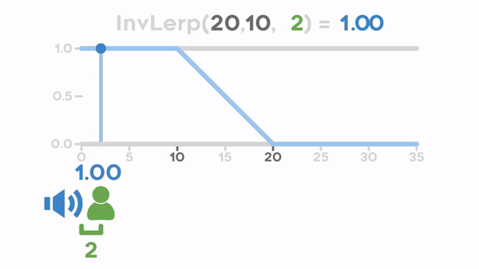

# Unity Functions overview

## Transform

### [Translate](https://docs.unity3d.com/ScriptReference/Transform.Translate.html)

``` csharp
transform.Translate(Vector3.right * (horizontal * Time.deltaTime * speed));
```

## Lerp and Inverse Lerp




## Other functions

``` csharp
InvokeRepeating(nameof(SpawnAnimal), startDelay, spawnInterval);
```

``` csharp
Instantiate(animal, animal.transform.position, animal.transform.rotation);
```

Get orthographic camera size
```csharp
Camera cam    = Camera.main;
float  height = 2f * cam.orthographicSize;
float  width  = height * cam.aspect;
```