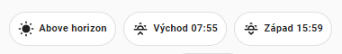

# Layout cheat sheet

## Custom buttons

### Simple custom button 1


``` Jinja
type: custom:button-card
entity: switch.bathroom_switch_left
name: Koupelna
styles:
  card:
    - width: 100px
    - height: 100px
```

### Simple custom button 1


``` Jinja
type: custom:button-card
entity: switch.bathroom_switch_left
name: Koupelna
color_type: card
state:
  - value: 'off'
    color: white
  - value: 'on'
    color: rgb(235, 219, 52)
styles:
  card:
    - width: 100px
    - height: 100px
```

## Change color based on state

``` Jinja
icon_color: |-
  
    blue
  
    grey
  
```

## Evaluate code and use the value

### Example 1
``` Jinja
name: |- 
  {{1 + 1}}
```

### Example 2

``` jinja
content: |-
    
    
        
    
    
        
    
    
        
    
    
        
    
    
        
    
    ({{total}}) Lights ON
```

## Sun




``` yaml
type: custom:mushroom-chips-card
chips:
  - type: entity
    entity: sun.sun
  - type: template
    content: >-
      Východ   {{
      (as_timestamp(states.sun.sun.attributes.next_rising)) |
      timestamp_custom(('%H:%M') )}} 
    icon: mdi:weather-sunset-up
  - type: template
    content: >-
      Západ   {{
      (as_timestamp(states.sun.sun.attributes.next_setting)) |
      timestamp_custom(('%H:%M') )}} 
    icon: mdi:weather-sunset-down
alignment: center

```
